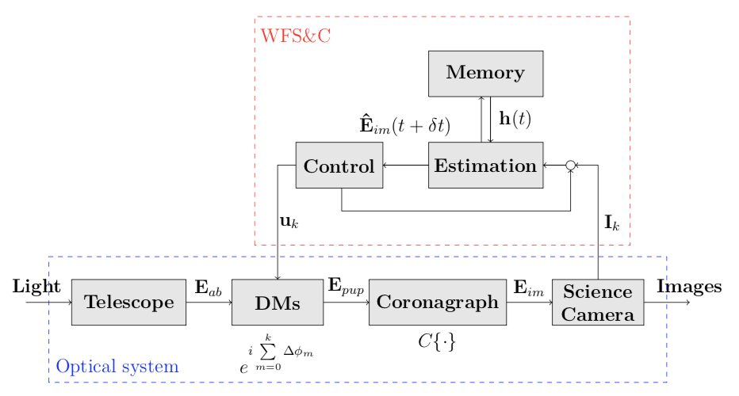
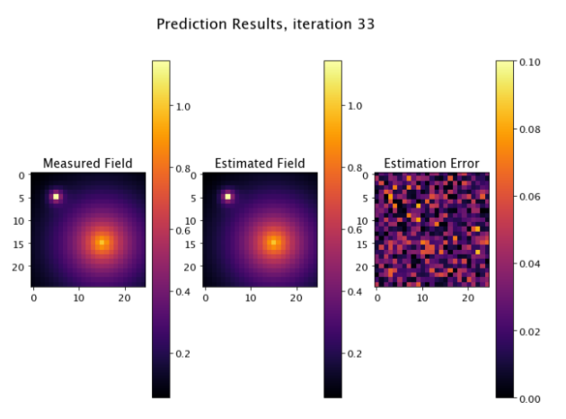
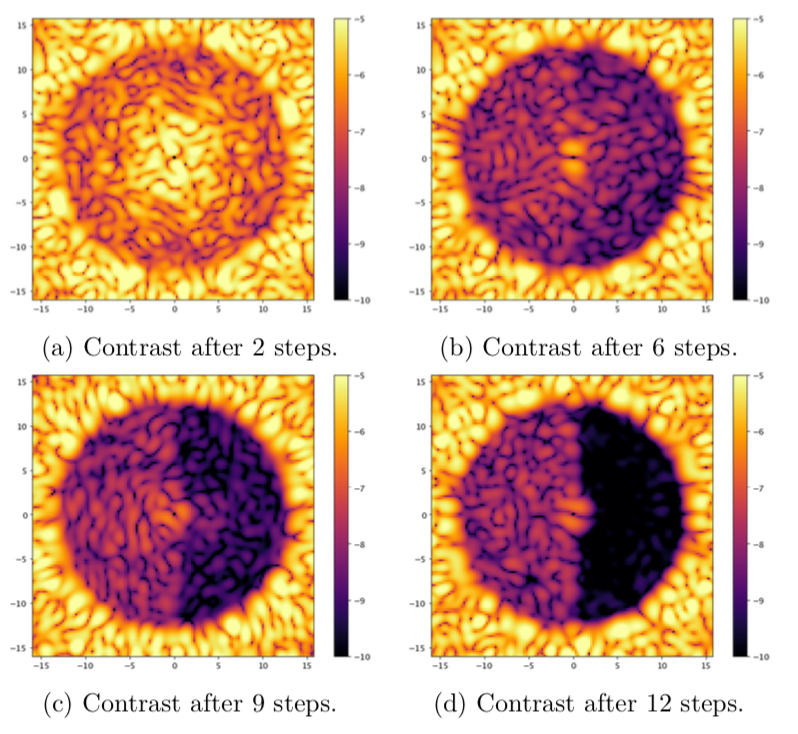

# Empirical Orthogonal Functions : An Estimation Algorithm for Electric Field Prediction

## Goal

Johns Hopkins University internship (2019-2020), in collaboration with the Space Telescope Science Institute.

We worked on the Wavefront Sensing and Control algorithms (in dotted red lines on the figure below) that are built next to the telescope's architecture. This work focuses on a time-series algorithm built to predict the electric field on the image plane of the camera.

 

 
## Results
The algorithm allows to estimate the electric field with high fidelity, much quicker than with expensive methods previously used (such as matrix inversion at every step, for every pixel), and takes advantage of the history of photons on the space camera.

 

 
The ultimate goal is to create a Dark Hole, a zone of deep contrast that could allow one to see very dim exoplanets. We iteratively use estimation and control algorithms to create a Dark Hole (the black semi-circle on the right of the camera) :

 

 
The algorithm was also implemented on the [HiCAT testbed](https://www.stsci.edu/stsci-research/research-topics-and-programs/russell-b-makidon-optics-laboratory) with moving averages, different sampling strategies, regularization and fast SVD.

## References

- Tyler D. Groff, A. J. Eldorado Riggs, Brian Kern, and N. Jeremy Kasdin. Methods and limitations of focal plane sensing, estimation, and control in high-contrast imaging. Journal of Astronomical Telescopes, Instruments, and Systems, 2(1):1 – 15, 2015.

- Guyon, O., & Males, J. (2017). Adaptive Optics Predictive Control with Empirical Orthogonal Functions (EOFs).

- He Sun, N. Jeremy Kasdin, and Robert Vanderbei. Identification and adaptive control of a high- contrast focal plane wavefront correction system. Journal of Astronomical Telescopes, Instru- ments, and Systems, 4(4):049006, 2018.

- Emiel H. Por, Sebastiaan Y. Haffert, Vikram M. Radhakrishnan, David S. Doelman, Maaike van Kooten, and Steven P. Bos. High Contrast Imag- ing for Python (HCIPy): an open-source adaptive optics and coronagraph simulator. In Laird M. Close, Laura Schreiber, and Dirk Schmidt, editors, Adaptive Optics Systems VI, volume 10703, pages 1112 – 1125. Interna- tional Society for Optics and Photonics, SPIE, 2018.
